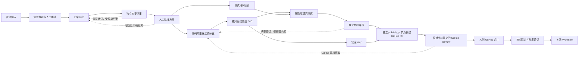

# MVP 交付流程与范围

状态：active（已确认设计，非实现完成）。最近核验：2026-09-27。

本文拥有首期用户流程、节点责任和业务门禁的详细描述，不拥有开发阶段状态、接口字段或数据库结构。上位边界见 [common](../../common.md)，选择原因见 [decision](../../decision.md)。

## 1. 验收场景

用户在 Web 配置 Workspace 的业务项目仓库、配套知识库仓库、执行能力和构建/验证命令，创建一个已有项目的小型功能或缺陷修复 WorkItem。系统从需求输入、知识绑定走到 PR 人工批准与合并、集成验证和关闭。

MVP 只提供一条固定工作流，不做多模板选择。后续新增流程复用已有能力、已有流程以新版本增加 Agent 节点的规则，见 [固定流程与执行边界](../architecture/workflow-execution.md)。

两个仓库承担不同职责：业务仓库可产生交付变更，知识库在运行期间只读。需要写第二个业务仓库的需求明确超出首期范围，不能静默把多个仓库塞进一个执行任务。

## 2. 流程责任表

本表表示逻辑责任，不提前冻结 NodeType、Capability ID 或 YAML 节点粒度。

实线表示首期交付责任的顺序与汇合；虚线表示有界返修控制，不是普通 DAG 循环。图中“人到 GitHub 合并”是外部人工动作，Kowa 观察并核对事实，不自造第二次合并批准。任务执行的 NodeType 与确切输入字段以正式契约为准。

| 步骤 | 输入 | 结果与放行条件 |
| :--- | :--- | :--- |
| 需求输入 | 用户原文、目标仓库 | 范围和验收标准足够明确 |
| 知识推荐 | 需求、已登记知识库的目录/索引 | 推荐条目及来源；读取失败与无相关知识分开 |
| 知识确认 | 推荐结果、用户增删 | 用户确认后的固定知识版本；未确认不进入方案 |
| 方案生成 | 需求、项目基线、知识快照 | 方案、修改范围与验证方案 |
| 独立方案评审 | 指定方案及依据 | 结构化结论与问题；需要修改时返修 |
| 人工方案批准 | 方案版本与评审结果 | 批准绑定所审方案，拒绝进入返修 |
| 编码与远端提交 | 批准的方案及输入 | Coder 在获准项目工作分支提交、推送；`verify_change` 核对远端 OID 与执行证据 |
| 测试设计与执行 | 验收标准、方案和已发布的指定提交 | 必需测试及其结果，失败不放行 |
| 独立代码评审 | 指定代码及需求、测试证据 | 结论与问题处置；阻断问题需返修 |
| PR 与人工审阅 | 经验证的交付版本、Runner 的 GitHub 身份 | 独立 `publish_pr` 节点以 Runner 机器账号创建 PR；有权真人且非 PR 作者针对当前提交提交有效 Review；Kowa 核实，不要求重复点击合并批准 |
| 合并与集成验证 | 获准交付对象 | GitHub 合并事实与明确合并版本的集成验证 |
| 关闭 | 必需交付证据 | 满足关闭条件后关闭 WorkItem |

测试设计可以在方案批准后与编码并行；测试执行、代码与安全评审消费远端可获取的对应提交，而不是 Coder 的本地目录。一个节点等待人工不自动阻塞所有无依赖分支。历史参考文档已核对，最终拓扑与扩展机制参见 [Workflow/Capability 扩展草案](../../research/workflow-capability-design.md)，准确 schema 尚待审定。

Coder 在获准 Task 内使用 Runner 所在机器已登录的个人 `gh`/Git 身份操作项目仓库工作分支；commit author/committer、实际 push 和 PR 创建者均归机器账号。Kowa 分别记录 Web 发起人、机器身份及 Agent 来源，不能把机器账号的 GitHub 写入归给 Web 发起人。`verify_change` 核对远端仓库、ref 和 OID；必需测试及独立评审通过后，独立 `publish_pr` 节点用同一机器身份创建 PR。GitHub 人工 Review 由有权真人且非 PR 作者完成，不额外要求其与 Web 发起人不同。Coder 可能凭宿主个人 `gh` 提前创建 PR；MVP 不为此增加专项检测或清理，正常流程仍只在 `publish_pr` 节点创建。

## 3. 人工责任和返修预算

- 知识由系统推荐、用户增删确认；首期不以向量检索为前提。
- 方案和代码自动评审各最多三轮自动返修：初次评审后的自动修订计数，初次评审不计返修轮次。
- 执行异常 Retry 与业务返修分别计数。不得用 Retry 偷换输入，或用新 Task 静默重置返修预算。
- 自动返修耗尽后转人工处置，选择继续返修、调整需求或取消；继续必须留下新增额度和理由。
- 必需验证失败保持失败事实；调整验收标准属于合同变化，需要明确确认，不能用“继续”按钮改写为通过。
- 方案、代码评审与人工批准均保存对象版本，不能只记一个无版本的通过标志。

## 4. 关闭与辅助工作

关闭至少具备需求/知识确认、有效方案批准、有效代码评审、必需验证通过、以 Runner 机器账号为 GitHub 创建者的 PR、有权真人且非 PR 作者针对当前 PR 提交的有效 GitHub Review、人工在 GitHub 完成合并的事实、合并后集成验证和无未决必需门禁。Kowa 不另设重复的合并批准按钮。Agent 自述完成、全部 Task 结束或 PR 已创建均不足以关闭。

关闭依据固定的合并结果版本，不能使用漂移的目标分支最新 HEAD。已关闭 WorkItem 不重开，后续修改创建关联新项。合并后验证失败而原项仍未关闭时，可以重试原版本验证；确需修改代码则由人确认新修复运行和新 PR，保留旧合并事实，不自动回滚。

知识更新建议仅产生 Artifact，由人审阅，不自动写知识库。建议失败保留待处理信息并允许重试，不阻止业务关闭。同步质量与安全评测是否属于门禁由交付合同明确；离线评测与持续校准不反向改变已完成交付状态。

## 5. 首期不交付的能力

多仓父子编排和 IDL 供给链、D2C、部署预览、任意 DAG 文件编辑或 Web 拖拽编排、Replay 操作、多 Runner 调度优化和高可用均后置。首期仍保留明确仓库身份、版本、输入输出和证据，不能用后置功能为本地路径耦合辩护。

## 6. 设计与验收入口

- [交付生命周期设计](../domain/delivery-lifecycle.md)：领域身份、业务结论与状态的关系。
- [契约草案](../../research/mvp-contracts-draft.md)：候选字段与消费规则，未冻结 wire。
- [GitHub 交付草案](../../research/github-delivery-design.md)：权限、事件与外部副作用。
- [后端模块与数据设计](../../Kowa后端设计/MVP模块与数据设计.md)。
- [前端信息架构](../../Kowa前端设计/MVP信息架构.md)。
- [验收矩阵](../../Kowa验收与运行/MVP验收矩阵.md)：目标断言，不是测试通过记录。
- [设计审阅与证据目录](../../research/mvp-design-review.md)：待确认项及历史依据。
